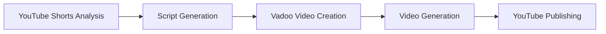

# YouTube Shorts Automation: From Trend Analysis to Video Publishing

## What This Does
This system automatically:
1. Analyzes trending YouTube Shorts
2. Generates video scripts
3. Creates videos using Vadoo
4. Publishes new Shorts to YouTube

## Overview
The YouTube Shorts Automation system streamlines the entire process of creating and publishing viral short-form content. It analyzes current trends, generates engaging scripts, creates professional videos through Vadoo, and handles the publishing process - all automatically.

## Architecture



## Core Components

### 1. ContentPipeline Class
The main orchestrator that manages the entire content generation workflow.

```python
from scrapers.youtube_shorts.shorts_scraper import YouTubeShortsAnalyzer
import asyncio
import requests

class ContentPipeline:
    def __init__(self):
        self.youtube_api_key = os.getenv('YOUTUBE_API_KEY')
        self.vadoo_api_key = os.getenv('VADOO_API_KEY')
        self.analyzer = YouTubeShortsAnalyzer(self.youtube_api_key)
```

### 2. Key Methods

#### generate_content()
The main pipeline executor that:
- Analyzes trending YouTube Shorts
- Generates content scripts
- Initiates video creation
- Handles YouTube posting

#### create_vadoo_video(script)
Handles video generation through Vadoo's API:
```python
vadoo_payload = {
    'script': script,
    'style': 'youtube_shorts',
    'aspect_ratio': '9:16',
    'duration': '60',
    'webhook_url': 'your_webhook_url'
}
```

## Implementation Guide

### 1. Prerequisites
```bash
# Required environment variables
YOUTUBE_API_KEY=your_youtube_api_key
VADOO_API_KEY=your_vadoo_api_key
```

### 2. Integration Steps

1. **Initialize the Pipeline**
```python
pipeline = ContentPipeline()
result = await pipeline.generate_content()
```

2. **Error Handling**
The pipeline includes comprehensive error handling:
```python
try:
    # Pipeline operations
    if not trending_shorts:
        raise Exception("No trending shorts found")
except Exception as e:
    return {
        'success': False,
        'error': str(e)
    }
```

3. **Vadoo Integration**
- Replace placeholder endpoints with actual Vadoo API endpoints
- Implement webhook handling for video completion notifications
- Configure video generation parameters based on your requirements

4. **YouTube Publishing**
- Implement video download from Vadoo
- Configure YouTube upload parameters
- Handle YouTube API quota limitations

## Response Formats

### Success Response
```json
{
    "success": true,
    "youtube_url": "https://youtube.com/shorts/example_id",
    "analysis": "Trend analysis data...",
    "script": "Generated script content..."
}
```

### Error Response
```json
{
    "success": false,
    "error": "Error description"
}
```

## Best Practices

1. **API Key Management**
   - Use environment variables
   - Implement key rotation
   - Monitor API usage

2. **Error Handling**
   - Implement retries for transient failures
   - Log errors comprehensively
   - Monitor pipeline health

3. **Performance Optimization**
   - Cache trending analysis results
   - Implement rate limiting
   - Use async operations for I/O-bound tasks

## Integration Example

```python
async def main():
    pipeline = ContentPipeline()
    
    # Configure custom parameters
    pipeline.set_vadoo_style("youtube_shorts")
    pipeline.set_video_duration(60)
    
    # Run the pipeline
    result = await pipeline.generate_content()
    
    if result['success']:
        print(f"Video published: {result['youtube_url']}")
    else:
        print(f"Error: {result['error']}")

if __name__ == "__main__":
    asyncio.run(main())
```

## Troubleshooting

### Common Issues and Solutions

1. **Vadoo API Connection Issues**
   - Check API key validity
   - Verify endpoint URLs
   - Confirm network connectivity

2. **Video Generation Failures**
   - Verify script format
   - Check video parameters
   - Monitor webhook responses

3. **YouTube Upload Issues**
   - Verify API quota
   - Check video format compatibility
   - Confirm account permissions

## Future Enhancements

1. **Planned Features**
   - Real-time trend monitoring
   - Multiple video style support
   - Advanced analytics integration

2. **Optimization Opportunities**
   - Parallel video generation
   - Caching system
   - Advanced error recovery

## Support and Maintenance

For technical support or feature requests:
1. Check the error logs
2. Review API documentation
3. Contact the development team

## Version History

- v1.0.0: Initial implementation
  - Basic pipeline functionality
  - Vadoo integration
  - YouTube publishing

---

*Last Updated: 2024* 